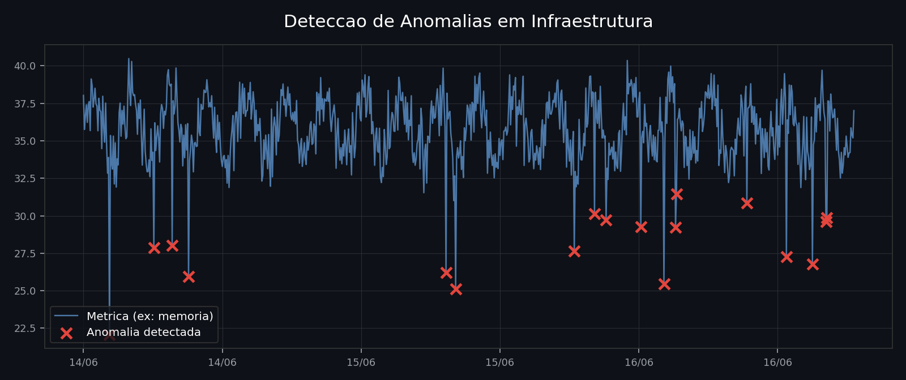

Criei um Detector de Anomalias, simples, mas funcional.

A ideia: em vez de depender só de alertas fixos (tipo "CPU passou de 90%"), o sistema aprende o padrão normal de cada métrica da infraestrutura — CPU, memória, rede, disco — e aponta sozinho quando algo foge do esperado, mesmo dentro dos limites tradicionais.

Como funciona, resumido:

1. Conecta na API do Zabbix e busca o histórico de qualquer métrica já monitorada.
2. Treina um modelo (Isolation Forest ou um autoencoder LSTM) que aprende o comportamento normal daquela métrica.
3. Compara dados novos contra esse padrão e sinaliza os pontos fora da curva — os "X" vermelhos na imagem.
4. Tudo por uma interface gráfica (Streamlit), sem precisar mexer em código: conectar, treinar e monitorar é tudo clicável.

Projeto aberto no GitHub, pra quem quiser conferir ou usar como base:
https://github.com/mmaxjr/Detector-de-Anomalias-em-Infraestrutura

#Python #Zabbix #MachineLearning #Infraestrutura
